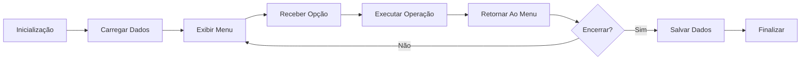
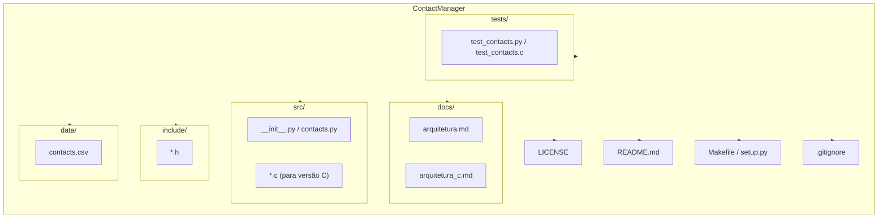

# Arquitetura Do Sistema 

## 1 - Visão Geral  

ContactManager é uma aplicação de terminal composta por módulos responsáveis pela interface com o usuário, gerenciamento de contatos e persistência de dados.

A arquitetura segue uma divisão simples de responsabilidades para facilitar manutenção e espansão futura.

## 2 - Componentes 

### Menu 
Responsável por: 
* Exibir as opções ao usuário 
* Receber entradas 
* Direcionar operações 
---
### Agenda 
Responsável por: 
* Adicionar contatos 
* Listar contatos 
* Buscar contatos 
* Remover contatos 
--- 
### Persistência  
Reponsável por: 
* Salvar contatos em arquivo 
* Carregar contatos do arquivo 

---
### Fluxo Geral 



## Estrutura de arquivos — Guia

A seguir está uma estrutura mínima recomendada para o projeto, com propósito de cada item. Use-a como referência ao criar o repositório ou portar para C.

```
ContactManager/
├─ LICENSE
├─ README.md
├─ docs/
│  ├─ arquitetura.md         # este documento (visão + guia)
│  ├─ arquitetura_c.md      # arquitetura mínima em C
│  └─ ...
├─ src/                    # código-fonte (Python ou C)
│  ├─ __init__.py
│  ├─ contacts.py
│  └─ ...
├─ include/                # cabeçalhos C (se portar para C)
│  └─ *.h
├─ data/                   # arquivos de persistência (CSV/JSON)
│  └─ contacts.csv
├─ tests/                  # testes unitários
│  └─ test_contacts.py
├─ Makefile / setup.py     # build ou instalação
└─ .gitignore
```

## Diagrama da Estrutura



## Referência ao UML
- O diagrama de classes UML está disponível em `docs/uml.md`.

