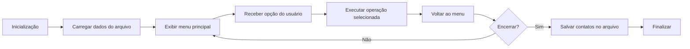

# Arquitetura do Sistema

## Visão Geral

ContactManager é um protótipo em C com divisão de responsabilidades entre interface, lógica de contatos e persistência.

A arquitetura atual separa:
- definição de tipos e assinaturas em `include/`
- operações de contato em `src/contact.c`
- persistência de dados em `src/storage.c`
- fluxo de execução e menu em `src/main.c`

O projeto também está evoluindo para uma arquitetura híbrida:
- PostgreSQL será adotado como backend de banco de dados para persistência mais robusta e escalável.
- Python será usado em tarefas auxiliares, como scripts de migração, importação/exportação e automações de manutenção.
- Uma interface gráfica será criada para oferecer uma experiência de usuário mais intuitiva além da linha de comando.

## Componentes principais

### `src/main.c`
Responsável por:
- inicializar o programa
- carregar os contatos do arquivo
- exibir o menu principal ao usuário
- disparar as operações correspondentes às opções escolhidas
- salvar os dados antes de encerrar

### `src/contact.c`
Responsável por:
- adicionar um contato à lista em memória
- listar contatos presentes em memória
- buscar contatos
- remover contatos

### `src/storage.c`
Responsável por:
- salvar os contatos em arquivo local
- carregar os contatos gravados ao iniciar o programa

### `include/contact.h`
Define a estrutura de dados `Contact` e as funções de contato.

### `include/storage.h`
Define as assinaturas de `saveContacts` e `loadContacts`.

## Fluxo geral esperado



## Estrutura de arquivos atual

```
ContactManager/
├─ README.md
├─ LICENSE
├─ docs/
├─ include/
│  ├─ contact.h
│  └─ storage.h
└─ src/
   ├─ main.c
   ├─ contact.c
   └─ storage.c
```

## Observações sobre o estado atual

- `src/contact.c` contém funções de cadastro e listagem em memória.
- `src/storage.c` está em desenvolvimento e precisa de correção para gravar e ler corretamente.
- `src/main.c` ainda não possui o menu completo nem a sequência de chamadas de rotina.
- O arquivo de persistência esperado é `data/contacts.txt`.
- A arquitetura futura prevê migração para PostgreSQL, adoção de Python em scripts de manutenção e a criação de uma interface gráfica.

## Referência
- Veja também `docs/modelos-de-dados.md` para o formato do contato e do armazenamento.
- O histórico de desenvolvimento está em `docs/diario/diario.md`.

