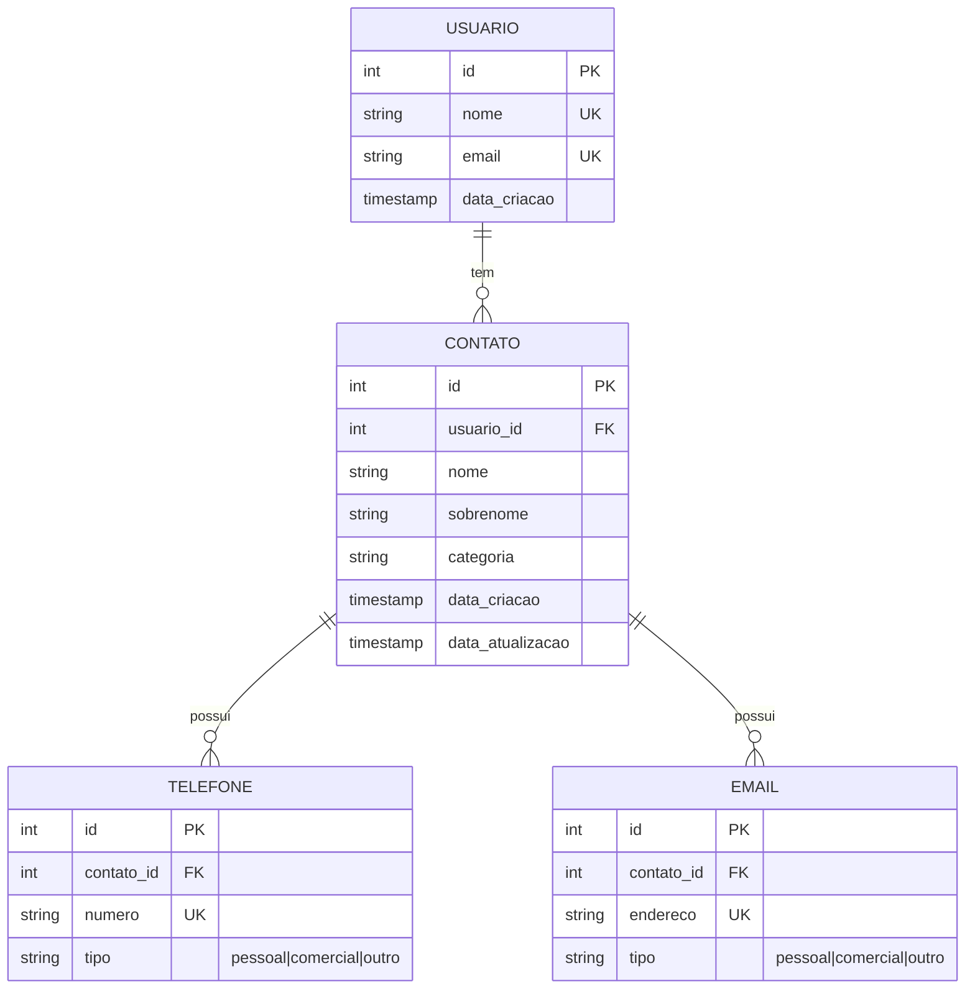

# Modelo de Dados

Este documento descreve o modelo de dados do ContactManager para PostgreSQL.

## Diagrama ER (Entity Relationship)


## Schema PostgreSQL

### Tabela: usuario
```sql
CREATE TABLE usuario (
    id SERIAL PRIMARY KEY,
    nome VARCHAR(100) NOT NULL UNIQUE,
    email VARCHAR(100) NOT NULL UNIQUE,
    data_criacao TIMESTAMP DEFAULT CURRENT_TIMESTAMP
);
```

### Tabela: contato
```sql
CREATE TABLE contato (
    id SERIAL PRIMARY KEY,
    usuario_id INTEGER NOT NULL REFERENCES usuario(id) ON DELETE CASCADE,
    nome VARCHAR(100) NOT NULL,
    sobrenome VARCHAR(100),
    categoria VARCHAR(50),
    data_criacao TIMESTAMP DEFAULT CURRENT_TIMESTAMP,
    data_atualizacao TIMESTAMP DEFAULT CURRENT_TIMESTAMP,
    UNIQUE(usuario_id, nome, sobrenome)
);
```

### Tabela: telefone
```sql
CREATE TABLE telefone (
    id SERIAL PRIMARY KEY,
    contato_id INTEGER NOT NULL REFERENCES contato(id) ON DELETE CASCADE,
    numero VARCHAR(20) NOT NULL UNIQUE,
    tipo VARCHAR(20) CHECK (tipo IN ('pessoal', 'comercial', 'outro'))
);
```

### Tabela: email
```sql
CREATE TABLE email (
    id SERIAL PRIMARY KEY,
    contato_id INTEGER NOT NULL REFERENCES contato(id) ON DELETE CASCADE,
    endereco VARCHAR(100) NOT NULL UNIQUE,
    tipo VARCHAR(20) CHECK (tipo IN ('pessoal', 'comercial', 'outro'))
);
```

## Índices para Desempenho
```sql
CREATE INDEX idx_usuario_nome ON usuario(nome);
CREATE INDEX idx_contato_usuario_id ON contato(usuario_id);
CREATE INDEX idx_contato_nome ON contato(nome);
CREATE INDEX idx_telefone_numero ON telefone(numero);
CREATE INDEX idx_email_endereco ON email(endereco);
```

## Consultas Básicas

### Listar contatos de um usuário
```sql
SELECT c.id, c.nome, c.sobrenome, c.categoria
FROM contato c
WHERE c.usuario_id = $1
ORDER BY c.nome;
```

### Buscar contato por nome
```sql
SELECT c.id, c.nome, c.sobrenome, c.categoria,
       t.numero, e.endereco
FROM contato c
LEFT JOIN telefone t ON c.id = t.contato_id
LEFT JOIN email e ON c.id = e.contato_id
WHERE c.usuario_id = $1 AND c.nome ILIKE $2;
```

### Adicionar novo contato
```sql
BEGIN;
INSERT INTO contato (usuario_id, nome, sobrenome, categoria)
VALUES ($1, $2, $3, $4)
RETURNING id;

INSERT INTO telefone (contato_id, numero, tipo)
VALUES (NEW_CONTATO_ID, $5, 'pessoal');

INSERT INTO email (contato_id, endereco, tipo)
VALUES (NEW_CONTATO_ID, $6, 'pessoal');
COMMIT;
```

### Remover contato
```sql
DELETE FROM contato WHERE id = $1 AND usuario_id = $2;
```

## Notas
- O modelo utiliza `ON DELETE CASCADE` para manter integridade referencial.
- Campos `data_criacao` e `data_atualizacao` rastreiam mudanças.
- Tipos de contato são restritos por `CHECK` constraints.
- Índices melhoram a performance nas consultas mais frequentes.
