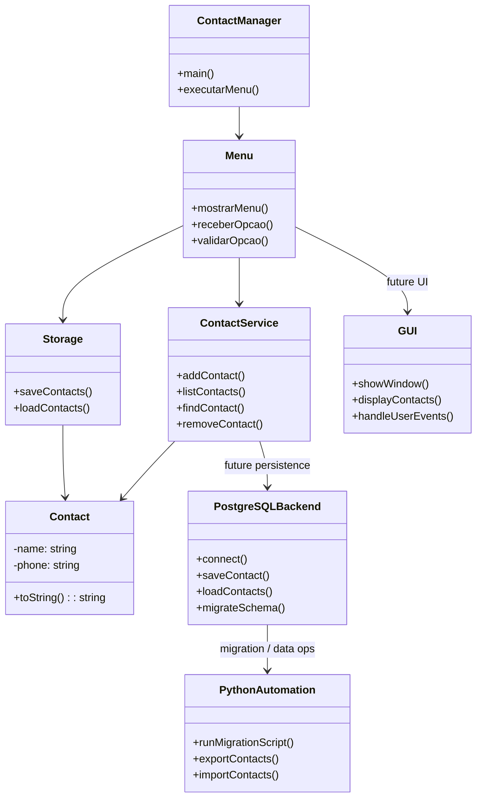

# Diagrama UML

Este documento contém o diagrama UML de classes e o planejamento ágil do sistema ContactManager.

## Visão UML Estendida

## O que foi feito

- Implementado o núcleo do CLI em `src/main.c` com menu e chamadas para adicionar/listar contatos.
- Desenvolvidas as funções `addContact` e `listContacts` em `src/contact.c`.
- Criado o módulo de persistência em `src/storage.c` com `saveContacts` e `loadContacts`.
- Organizada a documentação em `docs/`, incluindo diário por dias e arquitetura.
- Configurado CI/CD em `.github/workflows/ci.yml` e criado a tag local `v1.0.0`.

## O que vai ser feito

- Finalizar implementação de `removeContact` e `findContact` no backend C.
- Corrigir e validar o armazenamento local em `src/storage.c` para garantir persistência confiável.
- Migrar parte da persistência para PostgreSQL como backend robusto.
- Criar scripts Python para migração de dados, importação/exportação e automações auxiliares.
- Desenvolver a interface gráfica do projeto para melhorar a usabilidade.
- Atualizar requisitos e arquitetura com o novo modelo híbrido.

## Prazo e planejamento ágil

### Sprint 1 — 09/06/2026 a 16/06/2026
- Objetivo: estabilizar a versão CLI completa e a persistência local.
- Entregáveis:
  - implementação de `removeContact` e `findContact`.
  - salvamento e carregamento de contatos funcionando.
  - documentação atualizada sobre o estado atual.
- Critério de aceitação:
  - o programa compila sem erros e suporta adicionar, listar, buscar, remover e salvar contatos localmente.
  - os testes básicos de fluxo CLI passam.

### Sprint 2 — 17/06/2026 a 23/06/2026
- Objetivo: introduzir o backend PostgreSQL e automações Python.
- Entregáveis:
  - modelo de dados PostgreSQL definido.
  - scripts Python para criar a tabela e migrar dados do arquivo local.
  - documentação do novo backend e dos scripts.
- Critério de aceitação:
  - existe conexão funcional com PostgreSQL.
  - dados podem ser movidos entre o arquivo local e o banco PostgreSQL.

### Sprint 3 — 24/06/2026 a 30/06/2026
- Objetivo: desenvolver a primeira interface gráfica do projeto.
- Entregáveis:
  - protótipo de UI gráfica integrado ao backend.
  - descrição do fluxo de uso do GUI.
- Critério de aceitação:
  - a interface gráfica oferece as operações básicas de contato.
  - a UI se conecta corretamente ao backend de dados.

## Critérios de aceitação gerais

- O ContactManager deve suportar o ciclo completo de cadastro, visualização, busca, remoção e persistência.
- A documentação deve refletir claramente o estado atual e o plano de evolução.
- Cada sprint deve ter entregáveis definidos e testáveis.
- A adoção de PostgreSQL e Python deve ser documentada como evolução planejada, sem comprometer o funcionamento atual em C.
